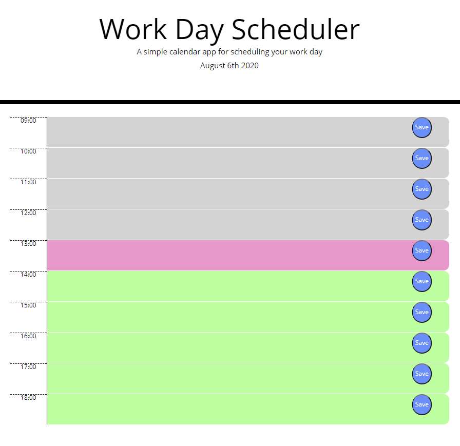

This is a simple work day scheduler. The user enters a meeting or other scheduled event which is saved in local storage. The colors of each hour changed based on the current time. 

https://joannatanveer.github.io/Calendar/

